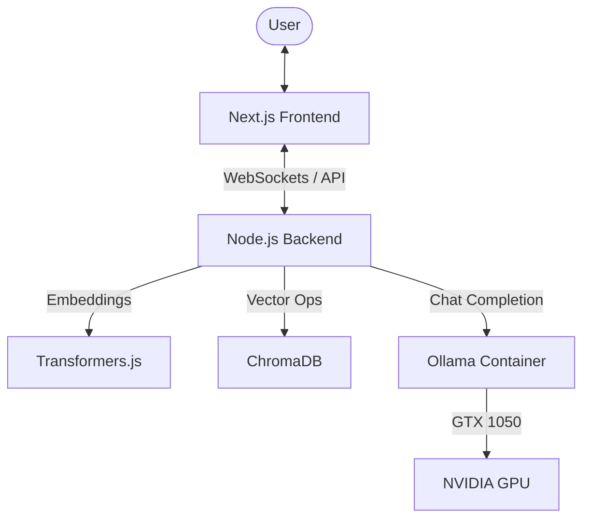

# AI-Powered RAG System (Modern UI + Streaming)

A premium Retrieval-Augmented Generation (RAG) system built with **Next.js 15**, **Node.js**, **Socket.io**, **ChromaDB**, and **Ollama**. This system features a sleek ChatGPT-like interface with real-time word-by-word streaming responses and GPU-accelerated local processing.

## 🚀 Key Features

- **Real-time Streaming**: Experience word-by-word responses powered by WebSockets (Socket.io).
- **Modern UI/UX**: Premium centered chat layout with glassmorphism effects and a document-focused sidebar.
- **Local RAG**: Process documents (PDF, DOCX, TXT) entirely on your machine using ChromaDB and Ollama.
- **GPU Acceleration**: Built-in support for NVIDIA GPUs via Docker.
- **Hot Reloading**: Fully Dockerized development flow with volume syncing.

## 🏗️ Architecture



## 🛠️ Setup Guide

### Prerequisites
- [Docker](https://docs.docker.com/get-docker/) & [Docker Compose](https://docs.docker.com/compose/install/)
- [NVIDIA Container Toolkit](https://docs.nvidia.com/datacenter/cloud-native/container-toolkit/install-guide.html) (optional, for GPU support)

### Installation

1. **Clone the repository:**
   ```bash
   git clone https://github.com/pappukrs/RAG_SYSTEM.git
   cd RAG_SYSTEM
   ```

2. **Start the environment:**
   ```bash
   docker compose up --build
   ```

3. **Pull the LLM Model:**
   While the containers are running, execute this in a new terminal:
   ```bash
   docker exec -it ollama ollama pull deepseek-r1:1.5b
   ```

## 🏃 Run Guide

1. **Access the App**: Open [http://localhost:3000](http://localhost:3000) in your browser.
2. **Upload Documents**: Use the sidebar to upload PDF, DOCX, or TXT files.
3. **Chat**: Once analyzed, start asking questions. The system will retrieve relevant context from your files and stream the answer in real-time.

## 📁 Project Structure

- `frontend/`: Next.js 15 application with Tailwind CSS and Lucide icons.
- `backend/`: Node.js/Express server using Socket.io for streaming.
- `backend/services/`: Core logic for embeddings, vector storage, and LLM integration.
- `docker-compose.yml`: Orchestrates ChromaDB, Ollama, Backend, and Frontend.

## 🔧 Troubleshooting

- **Socket Connection Errors**: Ensure the `NEXT_PUBLIC_API_URL` environment variable is correctly set to `http://localhost:4000/api`.
- **Sluggish Performance**: If not using a GPU, consider switching to a smaller model in `backend/services/llmService.js`.
- **Missing Dependencies**: If you see "Module not found", run `docker compose down -v` and rebuild.

---
Built with ❤️ by [Pappu Kumar](https://github.com/pappukrs)
