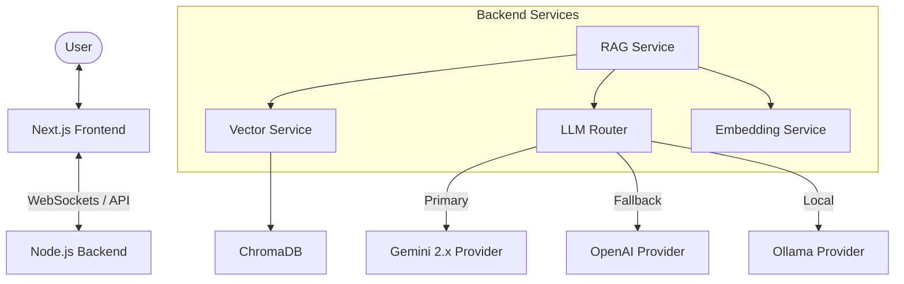
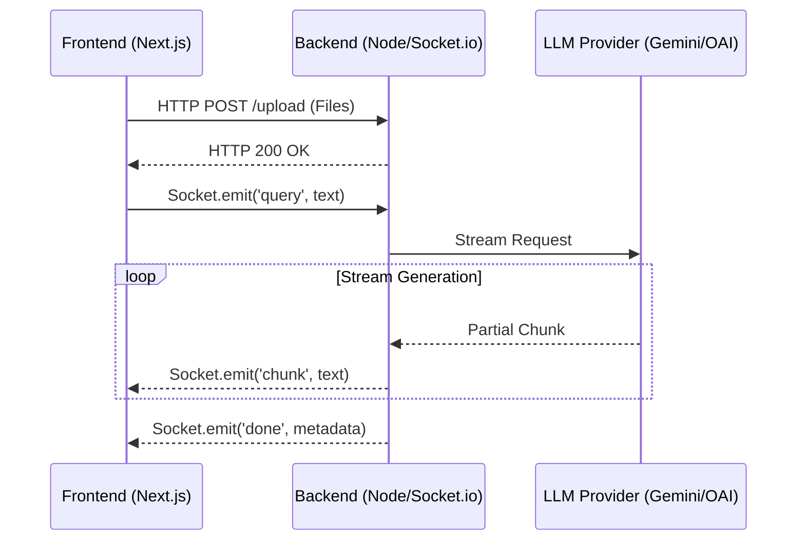

# AI-Powered RAG System (Modern UI + Streaming)

A professional Retrieval-Augmented Generation (RAG) system built with Next.js 15, Node.js, Socket.io, ChromaDB, and multi-model LLM support. This system features a centered chat interface with real-time streaming responses and advanced document processing capabilities.

## Key Features

- **Real-time Streaming**: Word-by-word response delivery using WebSockets for a responsive user experience.
- **Modern UI/UX**: Centered chat layout with glassmorphism effects and a document-focused sidebar for context management.
- **Multi-Model Support**: Integrated support for Google Gemini, OpenAI, and local Ollama models.
- **Intelligent LLM Routing**: Sophisticated routing logic with automatic failover and method-based fallback.
- **Efficient Document Processing**: Support for PDF, DOCX, and TXT files with local embedding generation and vector storage.
- **Dockerized Environment**: Fully containerized setup with optimized builds and service isolation.

## System Architecture

The following diagram illustrates the flow of data and the interaction between components:



## Multi-Model Design Implementation

The backend architecture leverages several design patterns to ensure flexibility and reliability in LLM interactions:

### 1. Strategy Pattern (LLM Providers)
Each LLM (Gemini, OpenAI, Ollama) is implemented as a discrete provider following a common interface. This allows the system to swap or add new models without changing the core RAG logic.

### 2. Factory Pattern (LLM Factory)
The `LLMFactory` centralizes the instantiation of providers based on environment configuration, decoupling the service layer from specific model implementations.

### 3. Router Pattern (LLM Router)
A specialized `LLMRouter` handles the intelligence of model selection:
- **Primary vs. Fallback**: If the primary provider (e.g., Gemini) fails, the system automatically redirects the request to a secondary provider (e.g., OpenAI).
- **Graceful Degradation**: If advanced features like streaming are unavailable for a specific model or region, the router falls back to standard generation to ensure system availability.

## Communication & Data Flow

The system employs a hybrid communication strategy to balance high-performance data transfer with real-time interactivity.

### 1. HTTP Protocol (RESTful API)
Used for stateless requests and bulk data transfer.
- **File Uploads**: Implementation uses `multipart/form-data` via `POST /api/upload`. This protocol ensures reliable transfer of larger document files (PDF, DOCX, TXT) to the server's staging area.
- **Infrastructure**: Standard Express.js routing handles these requests, providing a consistent interface for legacy or non-streaming operations.

### 2. WebSocket Protocol (Socket.IO)
Used for low-latency, bidirectional, real-time communication during the RAG process.
- **Event-Driven Architecture**:
  - `query`: The frontend emits this event containing the user's prompt.
  - `chunk`: The backend streams back partial LLM responses word-by-word. This provides immediate visual feedback to the user before the full generation is complete.
  - `done`: Emitted once the stream concludes, carrying the finalized source metadata and retrieval information.
  - `error`: Handles exceptional cases (like LLM timeouts or context exhaustion) gracefully without breaking the UI state.

### 3. Data Flow Visualization



## Setup Guide

### Prerequisites
- Docker & Docker Compose
- Node.js (for local development)
- API Keys for Gemini or OpenAI (optional, for cloud models)

### Installation

1. **Clone the repository:**
   ```bash
   git clone https://github.com/pappukrs/RAG_SYSTEM.git
   cd RAG_SYSTEM
   ```

2. **Configure Environment:**
   Update `backend/.env` with your API keys and preferred provider:
   ```env
   LLM_PROVIDER=gemini
   GEMINI_API_KEY=your_key_here
   ```

3. **Start the environment:**
   ```bash
   docker compose up --build
   ```

## Project Structure

- `frontend/`: Next.js 15 application with Tailwind CSS.
- `backend/`: Node.js/Express server.
- `backend/src/providers/`: LLM provider implementations and routing logic.
- `backend/src/services/`: Core RAG, Embedding, and Vector services.
- `docker-compose.yml`: Orchestration for ChromaDB, Backend, and Frontend.

---
Built by [Pappu Kumar](https://github.com/pappukrs)
